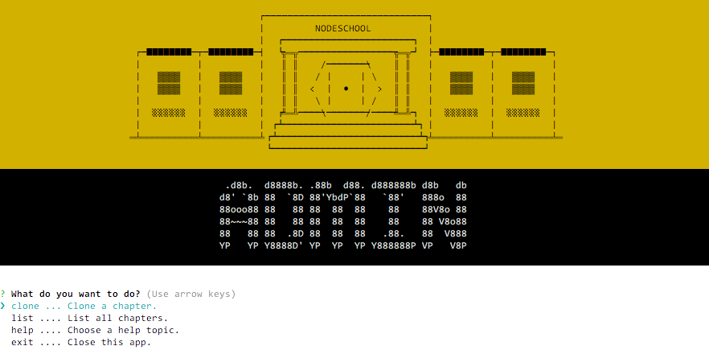

# NodeSchool Admin CLI Tool

Welcome to [NodeSchool](http://nodeschool.io)

`nodeschool-admin` is a CLI tool that should help you get your work done on NodeSchool.

# Installation

` npm i nodeschool-admin -g` 

# Usage

This tool has **two modes** depending on **the folder** in which it is executed!

# Chapter Mode
 
To be in `Chapter Mode` you need to move your terminal location to a folder that contains a git repository with a [remote](https://git-scm.com/docs/git-remote) pointing to the repo of your nodeschool chapter.

# Standard mode

The `Standard Mode` is active in every folder **except** folders that works for [`Chapter Mode`](#chapter-mode).

The application will show a nice dialog to choose your commands from there on.

Cheers.

# Develop
* Fork the repository
* Run with the following command `node ./bin/nodeschool-admin -p <full path to your chapter folder>`
* Happy coding
